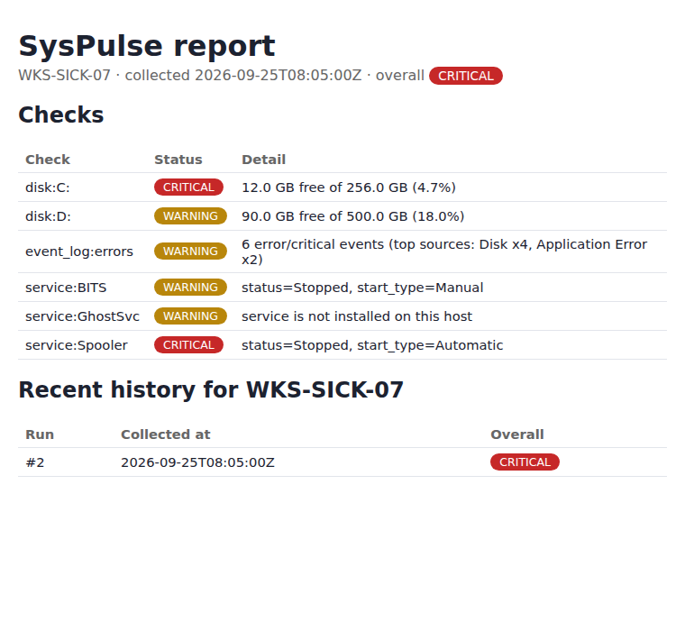

# SysPulse

[](https://github.com/SabirW/syspulse/actions/workflows/ci.yml)

A small IT health-check and reporting tool: a **PowerShell** script collects
a snapshot of a Windows machine (disk space, key services, recent event-log
errors), and a **Python** tool evaluates it against threshold rules, stores
the history in **SQLite**, and renders an HTML report.



## Why I built it

In my IT support role I used PowerShell daily to check disks, services and
the Event Log when a ticket came in, and I wanted a small project that
turns that manual routine into something repeatable and testable. The
PowerShell side collects; the Python side decides what matters, remembers
history, and reports it — so the two pieces stay independently testable.

## How it works

```
collect_windows.ps1  →  report.json  →  syspulse analyze  →  SQLite  →  syspulse show  →  report.html
   (PowerShell)                             (Python)                                        (HTML)
```

1. **`collectors/collect_windows.ps1`** runs on the target machine (or against
   `localhost`), reads disk usage, the status of a configurable list of
   services, and recent Error/Critical events from the Application and
   System logs, and writes it all as JSON.
2. **`syspulse analyze report.json`** applies threshold rules (see below),
   saves the run and its results to a SQLite database, prints a summary, and
   exits with a status code a scheduler can act on.
3. **`syspulse show`** renders the latest run (or a specific one) plus recent
   history as a single HTML file.

## Rules

| Check | OK | Warning | Critical |
|---|---|---|---|
| Disk free space | ≥ 20% | 10–20% | < 10% |
| Service (auto-start) stopped | running | — | stopped |
| Service (manual) stopped | running | stopped | — |
| Unknown/missing service | — | always | — |
| Error/critical events (lookback window) | ≤ 5 | 6–15 | > 15 |

Overall status is the worst individual result. Exit codes: `0` = OK,
`1` = WARNING, `2` = CRITICAL — meant to be read by Task Scheduler, cron, or
a Jenkins post-build step.

## Run it

**Collect** (on a Windows machine, PowerShell 5.1+ or pwsh):

```powershell
pwsh ./collectors/collect_windows.ps1 -OutFile report.json
# or check specific services / a shorter lookback window:
pwsh ./collectors/collect_windows.ps1 -Services "Spooler","MyAppService" -ErrorLookbackHours 12 -OutFile report.json
```

**Analyze and report** (Python 3.11+, stdlib only — no dependencies to run it):

```bash
python -m syspulse analyze report.json --db syspulse.db
python -m syspulse show --db syspulse.db --out report.html
```

**Tests:**

```bash
pip install -r requirements-dev.txt
pytest -v
```

There's no live Windows box in CI, so the pipeline validates the
PowerShell script's syntax with the .NET parser (`pwsh` ships on the
GitHub-hosted Ubuntu runner) and runs the full Python test suite against
two fixture reports (`tests/fixtures/healthy_host.json` and `sick_host.json`)
that stand in for a clean machine and a machine with real problems.

## Project structure

```
collectors/
  collect_windows.ps1   # the only OS-specific piece
syspulse/
  models.py              # Status enum, CheckResult
  rules.py                # thresholds → CheckResults (pure functions, no I/O)
  storage.py              # SQLite schema + queries
  report.py               # HTML rendering
  cli.py                  # analyze / show subcommands
tests/
  fixtures/                # sample collector output, healthy and sick
  test_rules.py, test_storage.py, test_report.py, test_cli.py
```

## Design notes

- **Rules are pure functions over plain dicts.** No I/O, no classes to
  instantiate — easy to unit test with fixture data instead of a real
  Windows machine, and easy to tune thresholds without touching storage or
  reporting.
- **Raw SQL, not an ORM.** `storage.py` uses `sqlite3` directly so the
  schema and queries are visible rather than generated.
- **HTML is escaped.** Event Log messages and service names are attacker-
  or garbage-controlled strings in the real world; `report.py` escapes
  everything it renders (see `test_render_html_escapes_untrusted_detail_text`).
